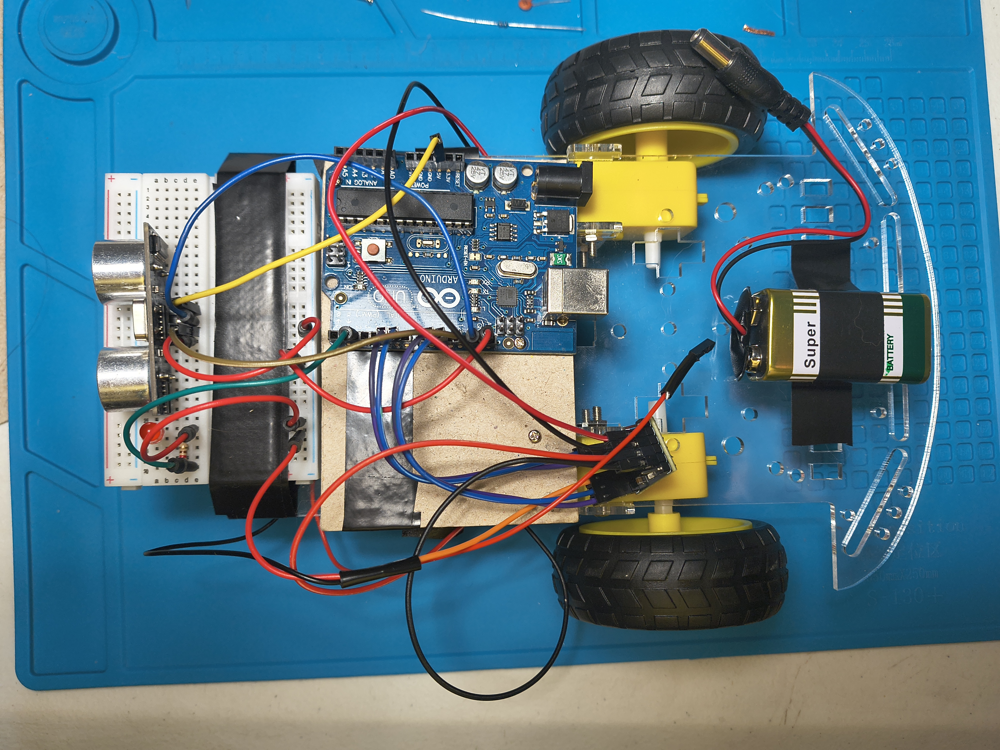
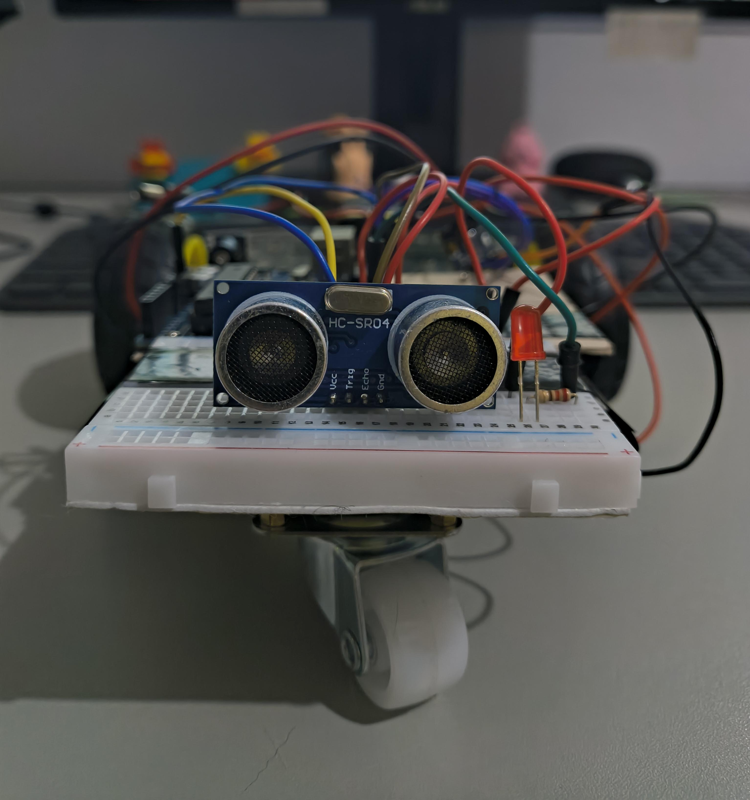
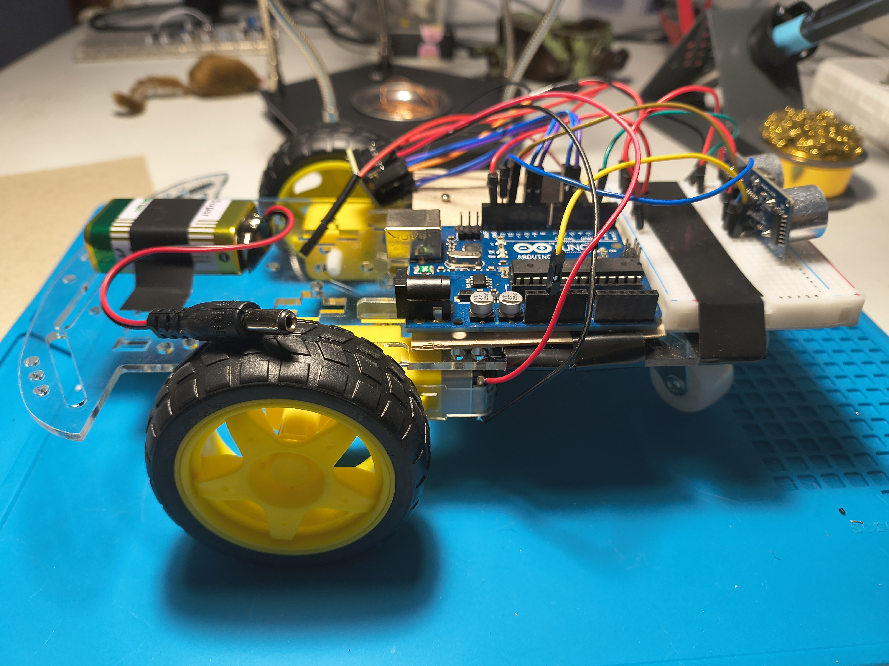
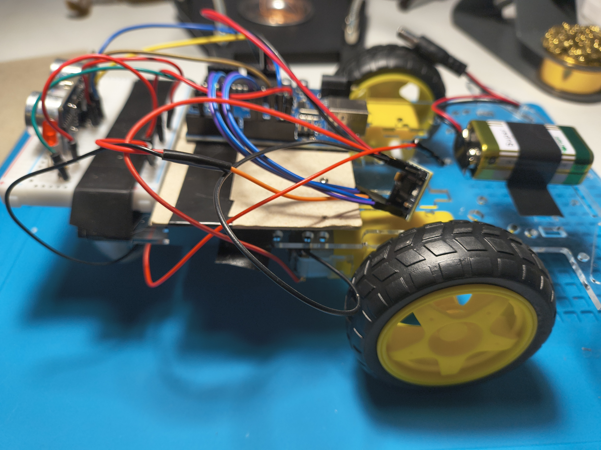
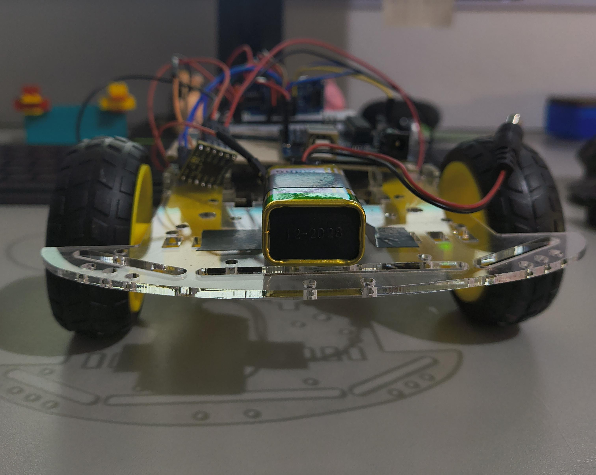
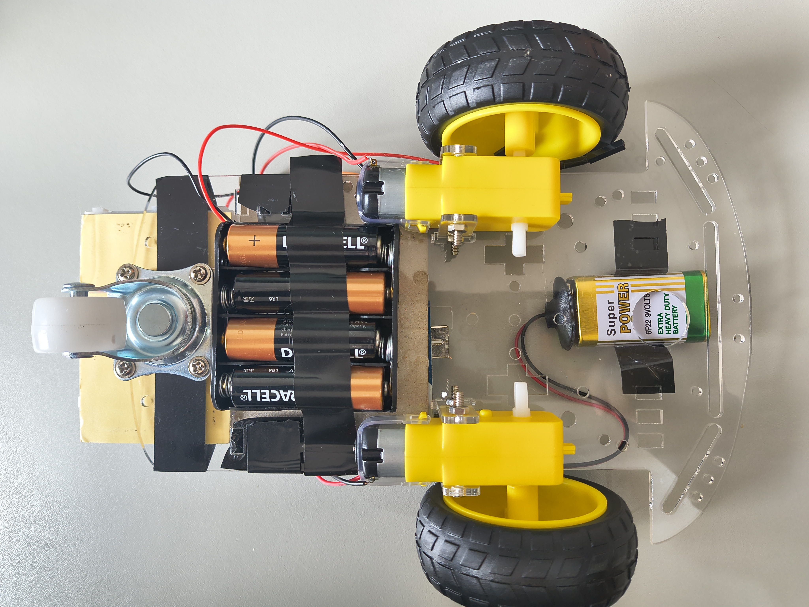

# Assembly

This is how Carronho were assembled. And may help you if you'll replicate it.

The .ino also has a guide on the wiring.

_Maybe just use the schematics?_

## Justifications

I choose to use an Arduino UNO 'cause this development board accepts a 9V battery directly. So I wouldn't need any leveling up or down the battery voltage.

The L298N were my 1st option 'cause is the most common used driver - despite it's heating. The plate I bought didn't work. 
Then, the L9110S were chosen because it was super cheap in my favourite component's store. It didn't work either. 
In the end, the DRV8833 were used 'cause it was the one my friend had available.

I had bought the switches to turn on/off Carronho but, since it was a ptototype, it made no sense to use any and they would be flying so it was the same as just pull the wires. So, i just pull the wires to turn Carronho off and connect them again to turn it on.

To avoid interference between microcontroller and gears (and batteries to last longer), Carronho will have energy input from two battery systems: a 9V battery for the Arduino UNO and 4xAA batteries for the gears with the gear box that came with the chassis kit.

**The fixing were made with friction tape** on the wires soldering protection, modules and the protoboard.

And I fixed the Arduino Uno in a rigid cardboard paper with some M1 standoffs (they almost weren't the right size for the Arduino's holes).

_Carronho looking from the top._

_Carronho's front._

_Left side of Carronho._

_Right side of Carronho._

_Carronho's rear._

The AA batteries were fixed on the underneath of the chassis, between the gears and by the universal wheel.

_The Carronho's below_

After assembling, I've noticed that I put the pieces on the opposite side from the chassis side... But who cares! (I'll fix it in Carrildo)

_some of the pictures were taken at my computer's desk and some were taken at my workbench._
